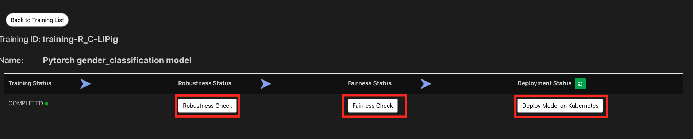

# FfDL KNative Demo

## prerequisite
1. Have a Kubernetes Cluster that has [KNative](https://github.com/knative/docs/blob/master/install/README.md) and [FfDL](https://github.com/IBM/FfDL) installed.
2. Following the [gender-classification-ffdl-example](gender-classification-ffdl-example) to train a gender classification model on FfDL.

## Steps
1. Once you have KNative installed, run the following commands to add the istio egress rules and RBAC service account.
```shell
kubectl apply -f demo-istio-setup
```

2. Create the kaniko template and starting build and serving pipeline components using KNative. The whole process usually takes 7-10 minutes.
```shell
kubectl apply -f https://raw.githubusercontent.com/knative/build-templates/master/kaniko/kaniko.yaml
kubectl apply -f fairness.yaml -f robustness.yaml -f deployment.yaml
```

  Also, you might want to [configure your KNative service with custom domain](https://github.com/knative/docs/blob/master/serving/using-a-custom-domain.md), so you can easily plugin with the FfDL GUI
  ```shell
  kubectl edit cm config-domain --namespace knative-serving
  ```

3. Go to the FfDL GUI page and enter the pipeline page of one of your trained model. Click on the Robustness check, Fairness check, or deploy model on Kubernetes to trigger the one of the pipeline components.
  
  Then you should see the pipeline component pod is scale from 0 to 1.

4. Now, make sure you serve your 2 of your models and markdown the revision name of each served model. Let's apply the KNative route rules to split the traffic between our 2 models
```shell
kubectl apply -f knative-route.yaml
```
