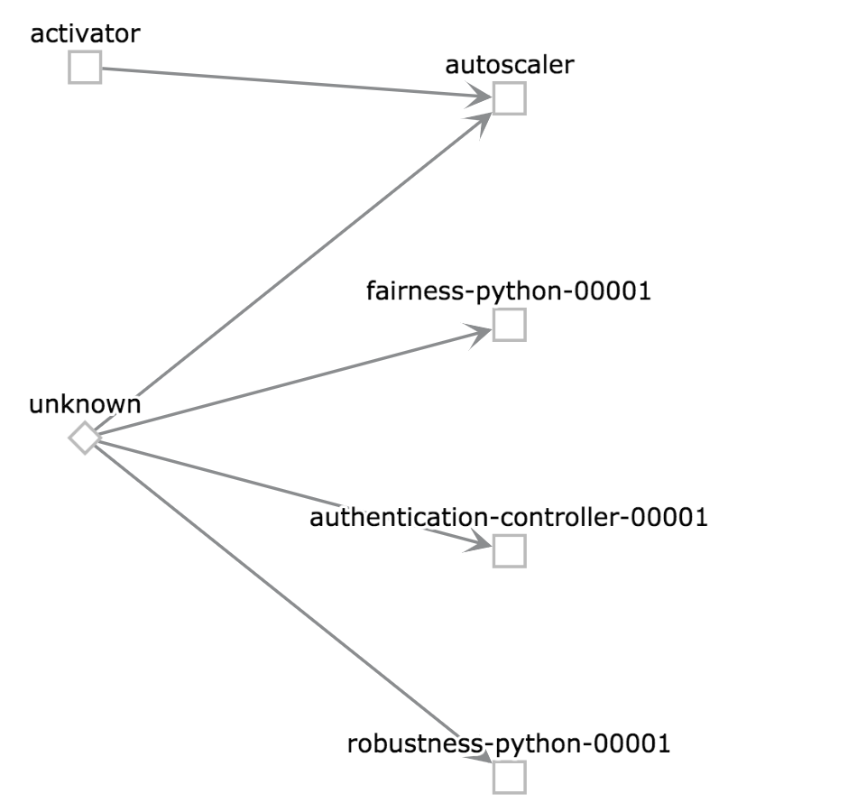
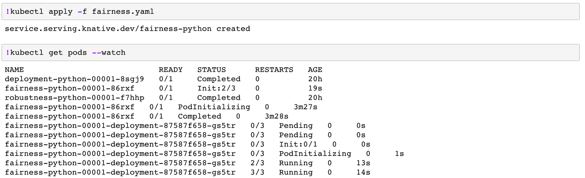
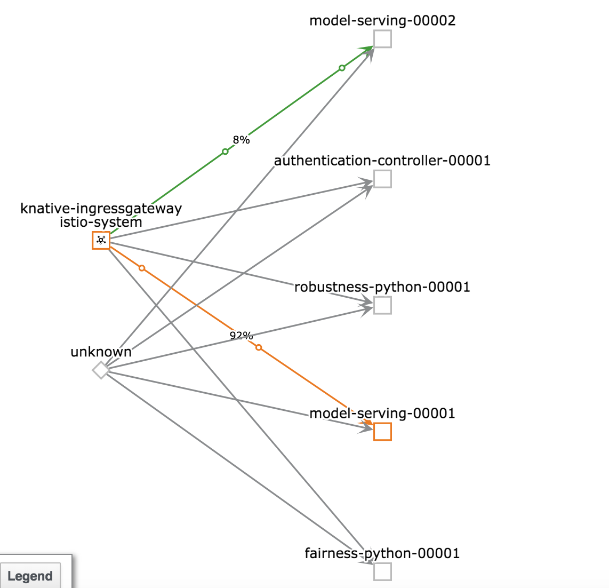
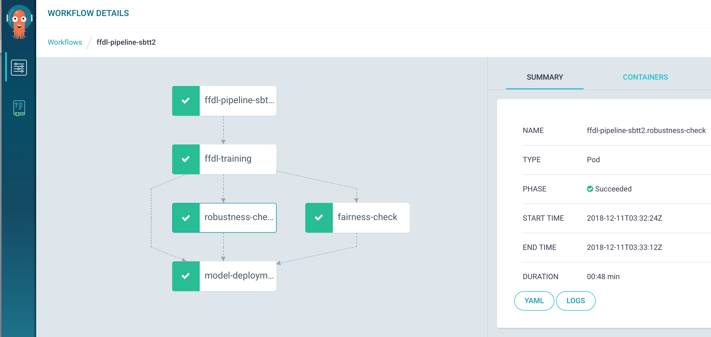

# FfDL KNative Demo

This is a Knative AI Platform demo as given at KubeCon. It walks you through on what Knative has to
offer:

1. It builds [AI Fairness 360 (AIF360)](https://github.com/IBM/AIF360) and [Adversarial Robustness Toolobox (ART)]() containers through Knative's Build component 
2. The built image is then deployed as a Knative Service, which means it scales automatically based on incoming requests, and scales down to zero if there is no traffic
3. We'll roll out a new version via a canary release.
4. The traffic will be split between the two versionsfor A/B testing
5. We can orchestrate the same containers using Argo for worklfow automation

## prerequisite
1. Have a Kubernetes Cluster that has [KNative](https://github.com/knative/docs/blob/master/install/README.md) and [FfDL](https://github.com/IBM/FfDL) installed.
2. Following the [gender-classification-ffdl-example](gender-classification-ffdl-example) to train a gender classification model on FfDL.

## Steps
1. Once you have KNative installed, run the following commands to add the istio egress rules and RBAC service account.
```shell
kubectl apply -f demo-istio-setup
```

2. Create the kaniko template and starting build and serving pipeline components using KNative. The whole process usually takes 7-10 minutes.
```shell
kubectl apply -f https://raw.githubusercontent.com/knative/build-templates/master/kaniko/kaniko.yaml
kubectl apply -f fairness.yaml -f robustness.yaml -f deployment.yaml
```
Looking at for e.g. at fairness.yaml, it pulls the source code and uses DOCKERFILE to build the image. The yaml also creates a Knative service for AI Fairness 360

```yaml
apiVersion: serving.knative.dev/v1alpha1
kind: Service
metadata:
  name: fairness-python
  namespace: default
spec:
  runLatest:
    configuration:
      build:
        apiVersion: build.knative.dev/v1alpha1
        kind: Build
        spec:
          serviceAccountName: build-bot
          source:
            git:
              url: https://github.com/Tomcli/ffdl-knative
              revision: master
          template:
            name: kaniko
            arguments:
            - name: IMAGE
              value: docker.io/tomcli/fairness-knative
            - name: DOCKERFILE
              value: ./Dockerfile-fairness
      revisionTemplate:
        spec:
          containerConcurrency: 0
          container:
            image: docker.io/tomcli/fairness-knative
```

  Then, you should able to see how knative build and deploy the revision
  ```shell
  $ kubectl get pods --watch
  fairness-python-00001-86rxf     0/1     Init:2/3          0     19s
  fairness-python-00001-86rxf     0/1     PodInitializing   0     3m27s
  fairness-python-00001-86rxf     0/1     Completed         0     3m28s
  fairness-python-00001-deployment-87587f658-gs5tr   0/3   Pending   0     0s
  fairness-python-00001-deployment-87587f658-gs5tr   0/3   Pending   0     0s
  fairness-python-00001-deployment-87587f658-gs5tr   0/3   Init:0/1  0     0s
  fairness-python-00001-deployment-87587f658-gs5tr   0/3   PodInitializing   0     1s
  fairness-python-00001-deployment-87587f658-gs5tr   2/3   Running   0     13s
  fairness-python-00001-deployment-87587f658-gs5tr   3/3   Running   0     14s
  ```

  Also, you might want to [configure your KNative service with custom domain](https://github.com/knative/docs/blob/master/serving/using-a-custom-domain.md), so you can easily plugin with the FfDL GUI
  ```shell
  kubectl edit cm config-domain --namespace knative-serving
  ```

  At this moment kiali shows the following view of our knative deployment

  

3. Go to the FfDL GUI page and enter the pipeline page of one of your trained model. Click on the Robustness check, Fairness check, or deploy model on Kubernetes to trigger the one of the pipeline components.

  
  Then you should see the pipeline component pod scales from 0 to 1. 

 

  After all the tests are completed, you should be able to see the results of running all the steps in the pipeline.

  

4. Now, make sure you serve your 2 of your models and markdown the revision name of each served model. Let's apply the KNative route rules to split the traffic between our 2 models
```shell
kubectl apply -f knative-route.yaml
```
In this yaml, we are sending 90% of traffic to Model version v1, and rest of it to v2.

```yaml
apiVersion: serving.knative.dev/v1alpha1
kind: Route
metadata:
  name: knative-demo
  namespace: default
spec:
  traffic:
    - revisionName: model-serving-00001
      percent: 90
    - revisionName: model-serving-00002
      percent: 10
```

When we look at Kiali at this point in time, this is how Kiali will look like



5. After you have every component ready to function, you can also tie them in a pipeline using Argo workflow orchestrator

 
